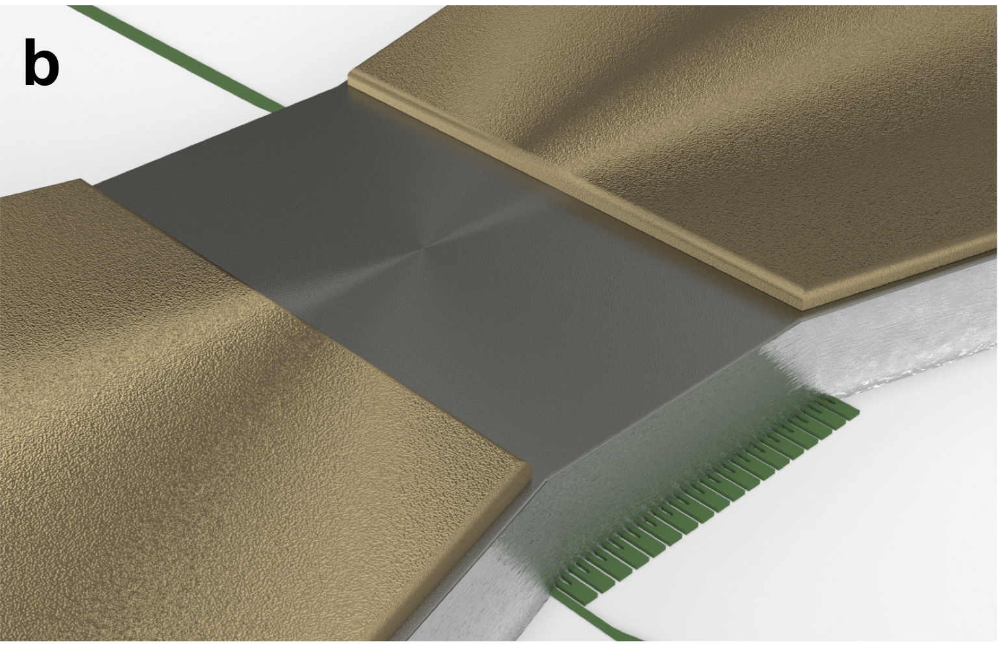

NIST SOEN Process Design Kits
=================================================

This technology package, a.k.a process design kit (PDK), defines the NIST superconducting optolectronics process: **OLMAC**. It is in the `klayout <https://www.klayout.de>`_ format of technology definition.

OLMAC combines **superconducting electronics**, such as SNSPDs and three-terminal devices, **active optoelectronics**, such as LEDs and modulators, and **passive optics**, such as waveguides and resonators.

.. It stands for Ol' Macdonald had a farm, EOEOE. EOEOE refers to the conversion of electric current to electric current with high gain and an Optical/Electrical/Optical intermediarity. This "intermediatiary" is a photonic neuron.

.. If you'd like, you could view this PDK as a standardization of an open optical process design kit. It pertains specifically to NIST's neuromorphic photonics process, yet it is theoretically applicable to SOI foundries, certain III/V business, proprietary BEOL steps, and in-house SiNx stuff (given a forthcoming package on advanced waveguide specification). Fork it, modify it, and, if you can generalize out the non-sensitive components of your work, make pull requests.

Contributors: Sonia Buckley, Adam McCaughan, Jeff Chiles, Alex Tait, Saeed Khan, Jeff Shainline, Rich Mirin, Sae Woo Nam

NIST, PML, Applied Physics, Faint/Quantum Nanophotonics group, Boulder, CO, United States

:ref:`Jump to installation <installation>`

What's in the box
-----------------

:ref:`Design Layers <layers>`
******************************
GDS layers, datatypes, names, and appearance in the ``.lyp`` format

klayout_layers_OLMAC.lyp
    Main design layers

camera_ready_OLMAC.lyp
    Another layer appearance specification that is better for making figures in powerpoint or papers.

:ref:`PCells <cells>`
*********************
This PDK includes standard devices as fixed cells (GDS) and `phidl <https://github.com/amccaugh/phidl>`_ code (python). See the link above for usage instructions. These HTML pages include optical/electron micrographs and measured data of the standard devices.

.. image:: src/cells/layout_pics/led_blender.png
    :target: src/cells/led.html
    :height: 150px
.. image:: src/cells/layout_pics/mmi1x2_cell.png
    :target: src/cells/mmi1x2.html
    :height: 150px

:ref:`Design Rules <design_rules>`
******************************************
They are visually explained in this documentation (not yet). A ``.lydrc`` file is included to integrate with klayout's DRC engine.

Layer Stack (this will link to the powerpoints)
***********************************************
Thicknesses, materials, and fabrication steps.

:ref:`xsection`: you can visualize the cross-sectional geometry of any layout in KLayout

:ref:`Platform Properties <properties>`
***************************************
Measured behavioral properties of the platform, such as waveguide loss and wire resistance.

.. warning::

    Some of these properties are not yet measured, as indicated in the properties files (.xml).

.. note::

    These are just XML files. We have a package in development that allows you to read these properties into phidl and use them in your layout/analysis code. Updates to come.

Mask preparation procedures
***************************
Section not finished. These files are found in the dataprep directory and run with the ``lymask`` package.

If you are a user, you probably don't have to worry about it.

Acknowledgements
----------------
PDK structure was modeled around the General Silicon Photonics (GSiP) tech found within the `SiEPIC-Tools <https://github.com/lukasc-ubc/SiEPIC-Tools>`_ project: (Lukas Chrostowski, Zeqin Lu, Jonas Flueckiger, Xu Wang, Jackson Klein, Amy Liu, Jaspreet Jhoja, and James Pond)

This documentation is templated upon `lightlab <https://lightlab.readthedocs.io>`_, the experimental frameworks of the Princeton Lightwave Research Laboratory: (Alex Tait, Thomas Ferreira de Lima, Bhavin Shastri, Mitch Nahmias, Heidi Miller, Siamak Abbaslou, Philip Yechi Ma, Chaoran Huang, Aashu Jha, Eric Blow, and Paul Prucnal)

.. toctree::
    :maxdepth: 1
    :caption: Contents

    src/installation
    src/layers
    src/cells/index
    src/drc/index
    src/xsection
    src/properties/index
    src/zreferences
    src/todo

