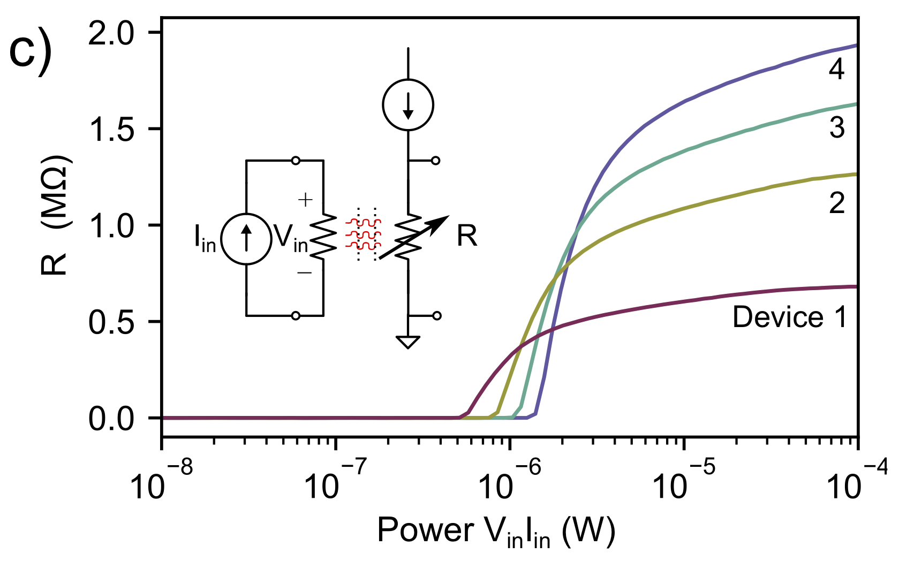

hTron
=====
Description
-----------
The hTron is a three-terminal superconducting device consisting of a normal heater directly over a superconducting meander. Its input is low impedance while its output is high impedance, and it has very good input-output isolation. These features make it ideal for transducing ~millivolt signals into ~Volt signals, forming a superconductor-to-semiconductor interface.

The hTron paper is published in [*insert citation with hyperlink*].

.. image:: micrographs/hTron_SEM.png
    :width: 45%
.. image:: layout_pics/hTron_blender.png
    :width: 45%

Characteristics
---------------
The basic in-out response is shown in :numref:`response`. There is a threshold power where the heat generated on the input resistor is enough to raise the temperature of the underlying meander, turning it normal.

.. _response:

    Basic response. Different lines correspond to different device sizes.

For significantly more detailed characterizations, see `the blog entry <https://qittlab-nuc-01.campus.nist.gov/wordpress/testing-high-speed-htron/>`_.

Layout
------
Here is `phidl <https://github.com/amccaugh/phidl>`_ script that makes an hTron region.

.. figure:: layout_pics/hTron_cell.png
    :figwidth: 500px
    :align: center

    The layout produced by the below code.

.. include:: ../../../pcells/htron.py
    :literal:
